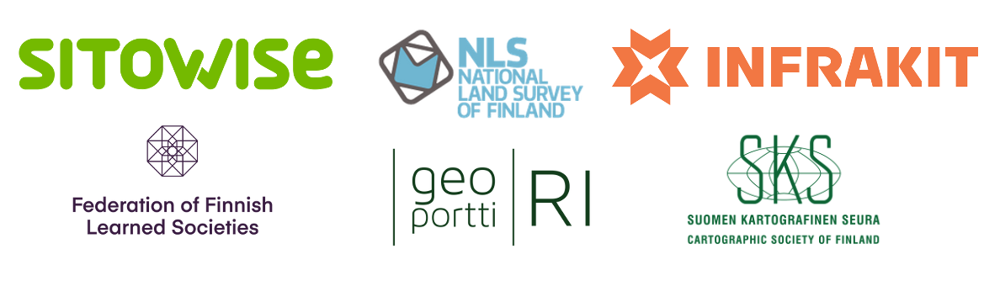

.. figure:: _static/logo-banner.png

Welcome to LBS 2025
===================================

Finnish Geospatial Research Institute (National Land Survey of Finland) and Aalto University are pleased to invite you to the 19th International Conference on Location Based Services (LBS 2025), which will take place in Otaniemi, Espoo, Finland on 7-9 May 2025. The conference is a joint effort of the ICA Commission on Location Based Services, the Commission on Digital Transformation of National Mapping Agencies, and the Commission on Cognitive Issues in Geographic Information Visualization.

Latest
------

- 15.3.2025 :doc:`Two side events <pages/side_events>` organized in conjunction with the LBS 2025 conference
- 15.3.2025 :doc:`Travel grants <pages/registration>` available to young researchers
- 11.3.2025 :doc:`Conference registration <pages/registration>` is now open!
- 1.3.2025 :doc:`Call for Papers <pages/call_papers>` is now closed

Keynote speakers
----------------

We are happy to announce that Prof. Ana Basiri from University of Glasgow (UK), Prof. Grant McKenzie from McGill University (Canada),
Prof. Heidi Kuusniemi from University of Vaasa (Finland), and Antti Vuorela from Helsinki Region Transport (HSL)
are our confirmed keynote speakers at LBS 2025.

.. grid:: 2
    :gutter: 2

    .. grid-item-card:: Prof. Anahid Basiri, |br| University of Glasgow
         :link: pages/keynote_speakers.html#ana-basiri
         :columns: 12 12 5 5
         :text-align: center

         .. figure:: img/Ana_Basiri_avatar_BW.jpeg
            :class: sd-avatar-xl

    .. grid-item-card:: Prof. Grant McKenzie, |br| McGill University
        :link: pages/keynote_speakers.html#grant-mckenzie
        :columns: 12 12 5 5
        :text-align: center

        .. figure:: img/Grant_McKenzie_avatar_BW.jpeg
           :class: sd-avatar-xl

    .. grid-item-card:: Prof. Heidi Kuusniemi, |br| University of Vaasa
         :link: pages/keynote_speakers.html#heidi-kuusniemi
         :columns: 12 12 5 5
         :text-align: center

         .. figure:: img/Heidi_Kuusniemi_avatar_BW.jpeg
            :class: sd-avatar-xl

    .. grid-item-card:: Antti Vuorela, |br| Helsinki Region Transport (HSL)
         :link: pages/keynote_speakers.html#antti-vuorela
         :columns: 12 12 5 5
         :text-align: center

         .. figure:: img/Antti_Vuorela_avatar_BW.jpeg
            :class: sd-avatar-xl

.. |br| raw:: html

      

Important Dates
---------------

The timeline that participants should consider is:

- **27.4.2025** Final date to register for the conference
- :strike:`6.4.2025 Deadline for early bird registration`
- **18.11.2024** :strike:`1.11.2024` Deadline for full papers
- **23.2.2025** :strike:`1.2.2025` Deadline for work in progress/abstracts
- **23.2.2025** :strike:`15.2.2024` Deadline for showcases
- **Registration:** Early bird -6.4.2025, Regular 7.-27.4.2025.
- **7.-9.5.2025** LBS 2025 Conference, Otaniemi, Espoo

Sponsors and Support
--------------------

.. toctree::
   :maxdepth: 1
   :hidden:

   pages/call_papers
   pages/registration
   pages/keynote_speakers
   pages/program
   pages/side_events
   pages/venue
   pages/travel_grant
   pages/contact
   pages/committee
   pages/former_conference

   .. pages/proceedings
   .. pages/dates

