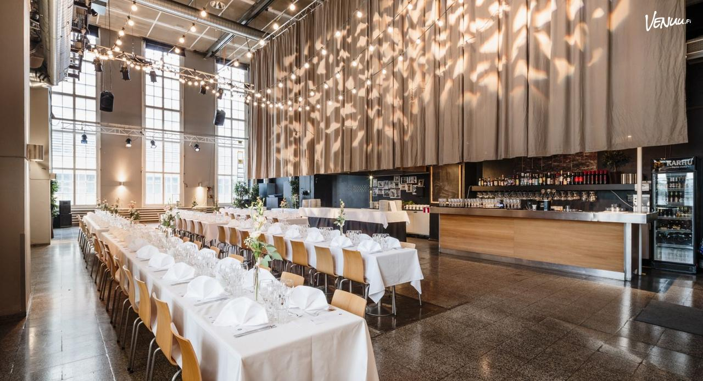

Venue 
===========

Main conference
---------------

.. figure:: ../img/dipoli.jpeg

LBS 2025 will take place in **Dipoli** at Otaniemi, Espoo, Finland. Dipoli is the main building of Aalto University and a conference center. Dipoli was originally designed in 1966 by Raili and Reima Pietilä as the new university building for technology students.

The main conference will be organized in Lumituuli auditorium which is one of the conference halls in Dipoli:

.. figure:: ../img/lumituuli.png

Location
~~~~~~~~

**Address**: Otakaari 24, Otaniemi, Espoo.

.. raw:: html

    

    

    <iframe src="https://www.google.com/maps/embed?pb=!1m18!1m12!1m3!1d890.8308025794746!2d24.83086357756325!3d60.18502861728542!2m3!1f0!2f0!3f0!3m2!1i1024!2i768!4f13.1!3m3!1m2!1s0x468df5ecd13f9ed1%3A0x4240e7a8e62add5a!2sDipoli!5e0!3m2!1sen!2sfi!4v1725373256772!5m2!1sen!2sfi" width="600" height="450" style="border:0;" allowfullscreen="" loading="lazy" referrerpolicy="no-referrer-when-downgrade"></iframe>
    

    

Conference dinner
-----------------

- **Time**: Thu 8th May starting at 18:30
- **Place**: Hima & Sali, Kaapitehdas, Helsinki (Address: Tallberginkatu 1C, 00180 Helsinki)

Icebreaker
----------

- **Time**: Wed 7th May starting at 18:00
- **Place**: Learning Hub Greenhouse, Computer Science building, Aalto University (Address: Konemiehentie 2, 02150 Espoo)

